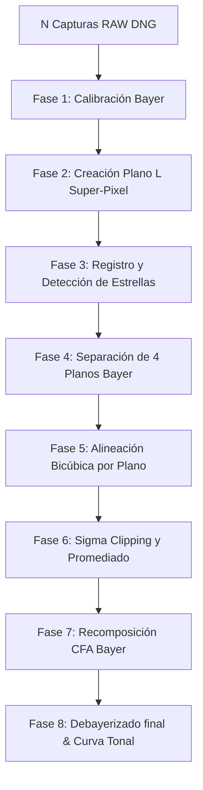

# Plan Estructurado: Implementación del Pipeline de Apilamiento RAW (Bayer) y Optimizaciones

Este documento define la especificación técnica definitiva y la hoja de ruta secuencial para implementar el pipeline de apilamiento en el dominio RAW (Bayer pattern) y las optimizaciones de memoria y UI en **CameraStellar v3**.

---

## 1. Arquitectura del Pipeline RAW Bayer (C++ NDK / OpenCV)

Para conservar la nitidez de las estrellas y maximizar la relación señal/ruido (SNR), el pipeline se ejecutará íntegramente en el dominio lineal de 16 bits sin demosaico previo.

### Detalle de las Etapas Técnicas:
1.  **Calibración en CFA:**
    *   Sustracción de `master_dark` de forma independiente para cada posición del mosaico (R, Gr, Gb, B).
    *   Aplicación de pedestal constante para evitar recortes a cero del ruido de lectura.
    *   Mitigación de píxeles calientes residuales mediante máscara de defectos estática.
2.  **Plano de Luminancia (L):**
    *   Generar un plano monocromo reduciendo la resolución a la mitad mediante el promedio de bloques 2x2 (Super-Pixel). Esto elimina la estructura de Bayer para el cálculo geométrico y acelera el procesamiento.
3.  **Detección de Estrellas:**
    *   Umbral adaptativo local basado en ruido sigma local sobre el plano L.
    *   Cálculo de centroides estelares con precisión subpíxel mediante ajuste cuadrático.
4.  **Registro RANSAC (Alineación):**
    *   Construir asterismos invariantes (triángulos) con las estrellas más brillantes.
    *   Estimar matriz afín de similitud (Traslación + Rotación) y refinar con RANSAC en OpenCV.
5.  **Alineación Bicúbica por Canal:**
    *   Separar el frame de luz calibrado en 4 imágenes monocromas de tamaño W/2 x H/2.
    *   Aplicar la matriz afín a cada canal por separado usando interpolación bicúbica.
6.  **Apilamiento Sigma Clipping:**
    *   Calcular Mediana y Desviación Absoluta Mediana (MAD) por píxel a lo largo de la ráfaga.
    *   Rechazar píxeles que superen un rango de desviación de `2.5 * MAD` para eliminar satélites y aviones.
    *   Promediar los píxeles limpios restantes.
7.  **Recomposición y Debayerizado:**
    *   Reinterpolar el mosaico Bayer apilado y aplicar algoritmo de demosaico Malvar-He-Cutler (OpenCV) seguido de balance de blancos y estiramiento de histograma.

---

## 2. Estrategia de Almacenamiento Temporal Híbrido

Para evitar crasheos por presión de memoria (OutOfMemory) al procesar múltiples frames DNG de 12-14 bits en dispositivos móviles, se implementará el siguiente flujo de almacenamiento:

| Tipo de Datos | Medio de Almacenamiento | Implementación Técnica | Razón |
| :--- | :--- | :--- | :--- |
| **Ráfagas de Captura RAW** | Disco (Caché temporal) mapeado en memoria | `MappedByteBuffer` (Java) / `mmap` (C++) | Libera el Heap de Java y permite acceso de baja latencia paginado por el SO. |
| **Master Dark Generado** | RAM compartida | `SharedMemory` / NDK Alloc | Requiere acceso repetitivo instantáneo en todas las sustracciones. |
| **Buffer Acumulador Stacking** | RAM | Native Memory (C++) | Almacena los acumuladores estadísticos (suma y conteo) de píxeles activos. |

---

## 3. Hoja de Ruta de Desarrollo (Roadmap por Fases)

### Fase 1: Optimización de Gestión de Memoria y Buffer (Android/Kotlin)
*   **Foco:** Garantizar estabilidad frente a OOM antes de iniciar el pipeline pesado.
*   **Tareas:**
    1.  Modificar `CameraControllerImpl.kt` para limitar la capacidad del canal de imágenes a `capacity = 3`.
    2.  Implementar la liberación síncrona `image.close()` inmediata en el callback de Camera2.
    3.  Asegurar que los DNGs temporales se escriban en `context.cacheDir` y se limpien al finalizar la sesión.

### Fase 2: Implementación de Calibración e Ingesta JNI en C++
*   **Foco:** Sustracción de Darks y almacenamiento híbrido nativo.
*   **Tareas:**
    1.  Completar `Java_com_stelllar_camera_domain_stacking_NativeStacker_addDarkFrame` en `native_stacker.cpp` para acumular darks en el array nativo.
    2.  Programar `finalizeMasterDark` para calcular la mediana/promedio del Master Dark por canal CFA.
    3.  Implementar la sustracción en C++ restando el canal correspondiente y aplicando el pedestal y nivel de negro de DNG.

### Fase 3: Detección, Alineación RANSAC y Stacking en C++
*   **Foco:** El núcleo algorítmico en C++ con OpenCV.
*   **Tareas:**
    1.  Programar la creación de plano L Super-Pixel 2x2.
    2.  Escribir el algoritmo de detección de estrellas y cálculo de centroides.
    3.  Implementar el emparejamiento de asterismos y estimación de homografía/matriz afín con RANSAC en `processLightFrame`.
    4.  Implementar la separación en 4 planos monocromos, aplicar transformación bicúbica y acumular estadísticas en el buffer nativo.

### Fase 4: Sigma Clipping, Debayer y Exportación
*   **Foco:** Generación del resultado final.
*   **Tareas:**
    1.  Escribir el bucle de combinación Sigma Clipping basado en MAD para promediar los planos limpios.
    2.  Aplicar demosaico de OpenCV y balance de blancos en C++.
    3.  Programar `finalizeStacking` para copiar la imagen final procesada al buffer de salida de Kotlin.

### Fase 5: Cierre de XML y Modernización Completa de UI
*   **Foco:** Limpieza de código e interfaz moderna.
*   **Tareas:**
    1.  Eliminar la dependencia de XML ViewBinding en `CameraActivity.kt`, migrándola a Compose puro.
    2.  Reemplazar Jetpack Navigation XML por Compose Navigation.
    3.  Eliminar layouts XML redundantes de la aplicación.

---

## 4. Criterios de Aceptación Globales
*   La aplicación debe compilar exitosamente en Kotlin 2.0.x y AGP 8.8+.
*   El pipeline de apilamiento debe procesar ráfagas de al menos 10 tomas RAW sin lanzar un `OutOfMemoryError`.
*   El resultado final del apilamiento no debe mostrar píxeles calientes ni estelas de satélites artificiales que crucen el campo de visión.
*   El script `.agents/scripts/run_tests.ps1` debe pasar en un 100% de manera local.
